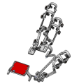
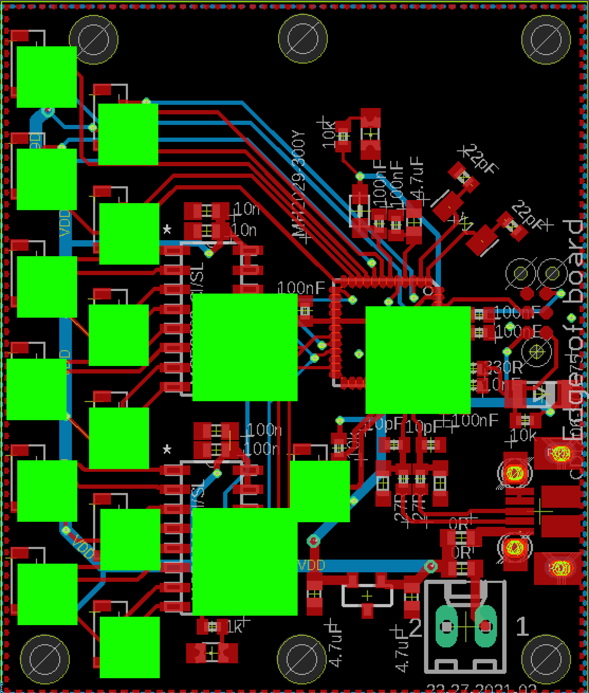
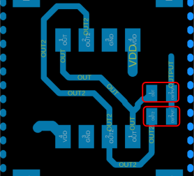

# Three-finger Exoskeleton
This project presents a software solution for the three-finger exoskeleton 
project using the custom PCB SAMD21G18A. 
The software is responsible for reading the analog values produced by the Melexis sensors attached to the exoskeleton and printing them to the serial output for further processing.

The board uses the SAMD21G18A QFN microcontroller, 
MCP3208 analogue to digital converters (ADCs).
For more information on the software please see the reference document 
[reference document](https://github.com/amartsop/ExoskeletonHandover/blob/master/main.pdf), while for the full documentation 
please visit the [API referece](https://amartsop.github.io/Exoskeleton/).

  

    
  

  

    
  

